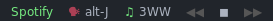
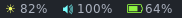
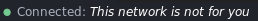

dotfiles
========
### Personal ubuntu configuration

This is the documentation of how my local system is setup. It's probably better than your current setup, but don't worry, feel free to clone and improve on this one!

#### Contents
The project contains a `makefile` for installing about everything you will need to get running, from browsers, spotify, programming languages, terminal setup, databases, and of course the one and only window manager: `i3wm`. More info on the makefile can be found [here](./makefile.md)

Also it contains my taskbar setup, which i will use the rest of this readme to brag about.

### Taskbar setup (legit shit 4sure)
Have you ever noticed that your taskbar is completely useless, then notice no more. Check this shit out:

##### spotify

_**tl;dr**: listen to you music and crack open that cold one instead of cracking those keystrokes_

yup _this boy_ supports spotify. So, `what does this give me?`, you may wonder. Well, now you can `play/pause/next/prev` directly from the taskbar, so that your non-programming friends don't have to learn your keystrokes in order to get to the spotify window to be able to skip to the next song or see what's playing.

##### toggl

not it starts getting interesting... toggl integration will list your current toggl timer if any. click to see the description. if no activity is ongoing, you can right click to start one. let's track that time without having to open that browser window ever again.

##### yr

the following description will seem way too familiar if you are a decent being writing some code every **now** and then:

_You are working on some serious bash code when your friend calls you and say: "hey you should come meet us at the beach, it's 30C and the girls are wearing bikinis", and you open your curtains, and now you're blind_

Well, don't cry: the `yr` integration solves this problem by giving you live temprature and weather statistics. Click the temprature to toggle wind speed and weather status.

##### system

boring, but handy shit you can use when you wanna make sure that window you forgot to close last night doesn't make any unpleasant sounds when you reopen your browser windows...

_PRO feature_: click the brightness icon to toggle **night mode**, so that you go manage to go to bed before that morning light kicks in. _some_ code may wait until tomorrow.

Also, the battery icon will ofc remind you that you're stupid if you let your battery percentage go too low.

##### wifi

will show that you're disconnected af, if you are. click to toggle network name

##### clock
yes, it's got a clock, but I don't even bother pasting in a screenshot here. it looks like this: `dd.mm.yyyy - hh:mm`
